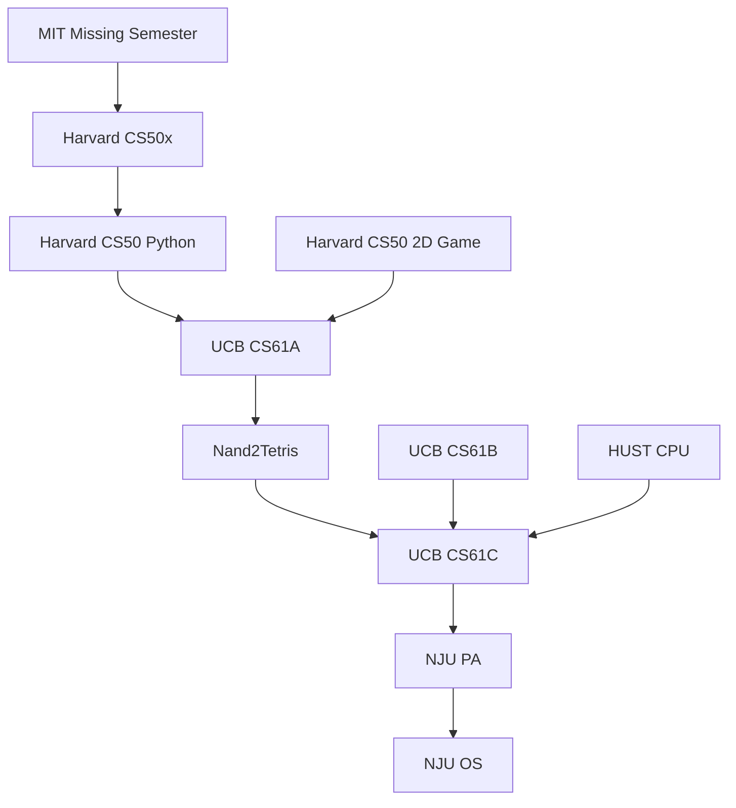

# 计算机废物自学指北

[csdiy.wiki](https://csdiy.wiki) 的 fork + @mancuoj 的自学路线图

```mermaid
flowchart TD
      A[MIT Missing Semester] --> B[Harvard CS50x]

      B --> C[Harvard CS50 Python]

      C --> E[UCB CS61A]
      D[Harvard CS50 2D Game] --> E

      E --> F[Nand2Tetris]

      F --> J[UCB CS61C]
      G[UCB CS61B] --> J
      H[HUST CPU] --> J

      J --> K[NJU PA]
      K --> L[NJU OS]
```
