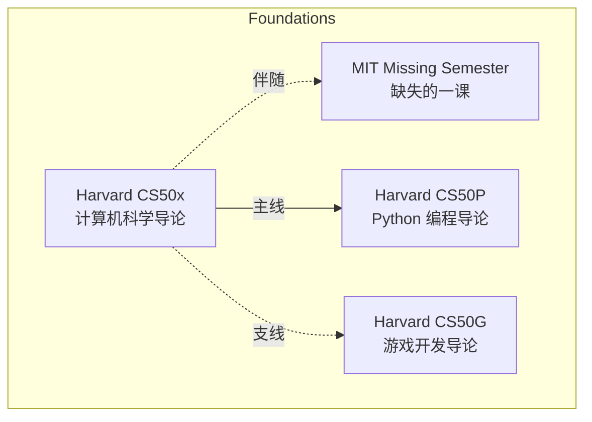

# CS Five

计算机废物自学指北，@mancuoj 的自学笔记。

```mermaid
flowchart TD
  subgraph Foundations
    CS50x["Harvard CS50x<br/>计算机科学导论"]
    MS["MIT Missing Semester<br/>缺失的一课"]
    CS50P["Harvard CS50P<br/>Python 编程导论"]
    CS50G["Harvard CS50G<br/>游戏开发导论"]
    CS50x -. 伴随 .-> MS
    CS50x -->|主线| CS50P
    CS50x -. 支线 .-> CS50G
  end
```
