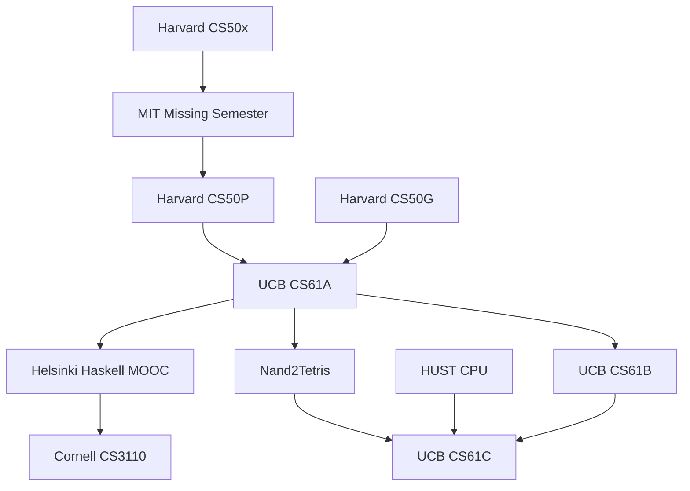

# 关于

## 只有提纲

以前每讲都写完整笔记，概念、例子和踩坑都会写进去。一篇会写很长，写完就没有再看过。

这些内容现在 AI 都能讲，而且比我讲得全。

所以现在每讲只列主题，一行一个。用的时候扫一遍，知道的跳过，不知道的去问 AI。问的时候让它给定义、一个最小例子和常见的坑，想深入再问延伸。

## 路线图

```mermaid
flowchart TD
      A[Harvard CS50x] --> B[MIT Missing Semester]

      B --> C[Harvard CS50P]

      C --> E[UCB CS61A]
      D[Harvard CS50G] --> E

      E --> Z[Helsinki Haskell MOOC]
      Z --> Y[Cornell CS3110]

      E --> F[UCB CS61B]
      E --> I[Nand2Tetris]

      I --> H[UCB CS61C]
      G[HUST CPU] --> H
      F --> H
```
