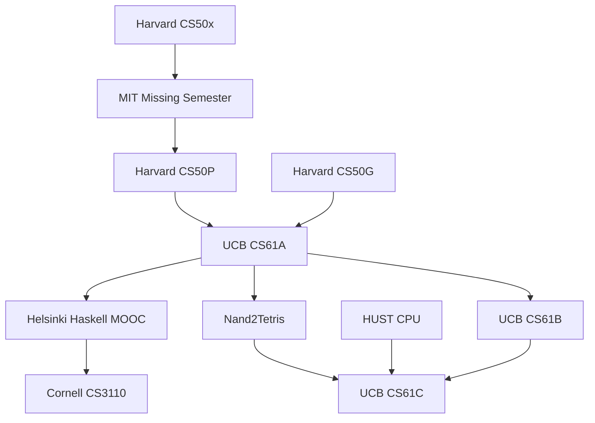

# 关于

重新开始自学 CS：先学透、动手做，只有值得反复回看的主题链才会沉淀到这里。

## 路线图

```mermaid
flowchart TD
      A[Harvard CS50x] --> B[MIT Missing Semester]

      B --> C[Harvard CS50P]

      C --> E[UCB CS61A]
      D[Harvard CS50G] --> E

      E --> Z[Helsinki Haskell MOOC]
      Z --> Y[Cornell CS3110]

      E --> F[UCB CS61B]
      E --> I[Nand2Tetris]

      I --> H[UCB CS61C]
      G[HUST CPU] --> H
      F --> H
```
