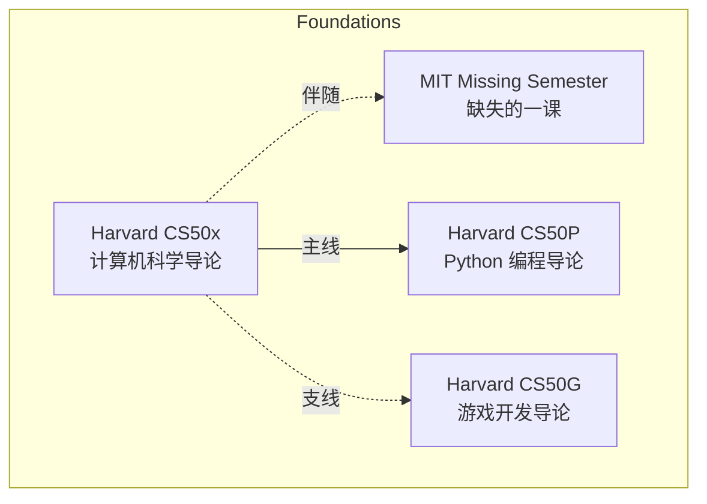

# 开始

AI 时代，很多东西一行提示词就能写出来。从零开始学计算机基础，或许不再那么「有用」，甚至以后也未必派得上用场。

但就算如此，我还是想亲手弄懂、写一遍，往自己脑子里真正内化一点东西。这里是我的学习记录。

## 路线图

```mermaid
flowchart TD
  subgraph Foundations
    CS50x["Harvard CS50x<br/>计算机科学导论"]
    MS["MIT Missing Semester<br/>缺失的一课"]
    CS50P["Harvard CS50P<br/>Python 编程导论"]
    CS50G["Harvard CS50G<br/>游戏开发导论"]
    CS50x -. 伴随 .-> MS
    CS50x -->|主线| CS50P
    CS50x -. 支线 .-> CS50G
  end
```
